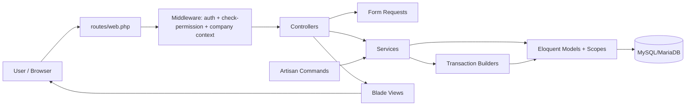

# Project Overview
FreeAmir is a Laravel 12 accounting application for Iranian businesses, focused on core bookkeeping,
invoicing, inventory cost flows, and fiscal-year operations with Persian-first localization. The project is
active development software (not yet production-ready), with business logic concentrated in services and
transaction builders to protect accounting invariants such as balanced documents and company scoping.

## Repository Structure
- `.github/`: Repository automation and AI guidance (`copilot-instructions.md`), with no CI workflows yet.
- `app/`: Core application code, organized by Laravel layers and domain services.
- `app/Console/Commands/`: Custom Artisan commands (including fiscal-year import/export workflows).
- `app/DTO/`: Typed data-transfer objects used for service/domain decision payloads.
- `app/Enums/`: Domain enums for invoice status/type, config keys, and fiscal-year sections.
- `app/Exceptions/`: Domain-specific exception types for service and transaction failures.
- `app/Helpers/`: Autoloaded helper functions/utilities (including Jalali date and number-to-word helpers).
- `app/Http/Controllers/`: HTTP endpoints and resource actions.
- `app/Http/Controllers/Auth/`: Authentication controllers and login/logout flow.
- `app/Http/Controllers/Management/`: User/role/permission management endpoints.
- `app/Http/Middleware/`: Cross-cutting request middleware (auth, permissions, company context, config).
- `app/Http/Requests/`: Form request validation classes for incoming HTTP payloads.
- `app/Models/`: Eloquent models for accounting entities (documents, invoices, products, customers, etc.).
- `app/Models/Scopes/`: Global scopes such as fiscal/company scoping rules.
- `app/Providers/`: Service providers and application bootstrapping hooks.
- `app/Services/`: Business logic layer, including accounting posting/building services.
- `app/View/Components/`: Reusable Blade view components.
- `bootstrap/`: Laravel bootstrap files and cached framework bootstrapping artifacts.
- `config/`: Laravel and package configuration (database, auth, queue, permission, translation, etc.).
- `database/`: Migrations, factories, and seeders for schema and test/demo data setup.
- `docs/`: Project/domain documentation (architecture, accounting basics, testing, database guides).
- `lang/`: Translation files for Persian and English locale strings.
- `public/`: Web root assets and front controller (`index.php`).
- `resources/`: Blade views plus source CSS/JS/fonts/images compiled by Vite.
- `routes/`: HTTP and console route definitions.
- `script/`: Data migration utilities and related import/export helper scripts.
- `storage/`: Runtime storage for logs, cache, sessions, compiled views, and app files.
- `tests/`: PHPUnit Feature and Unit test suites.
- `vendor/`: Composer-installed PHP dependencies (generated; do not edit manually).

## Main Packages
- `laravel/framework` `^12.0`: Core backend framework and application runtime.
- `laravel/sanctum` `^4.2`: Token-based authentication for API scenarios.
- `spatie/laravel-permission` `^6.4`: Roles and permissions authorization model.
- `carlos-meneses/laravel-mpdf` `^2.1`: PDF generation integration for Laravel.
- `doctrine/dbal` `^3.10`: Database abstraction helpers used for schema operations.
- `guzzlehttp/guzzle` `^7.2`: HTTP client for outbound service/API requests.
- `laravel/sail` `^1.44` (dev): Docker-based local development environment.
- `laravel/envoy` `^2.9` (dev): Deployment/remote task automation (`Envoy.blade.php`).
- `laravel/pint` `^1.0` (dev): PHP code formatting and style enforcement.
- `phpunit/phpunit` `^11.5.3` (dev): Unit and feature testing framework.
- `vite` `^7.0.7`: Frontend build tool/dev server.
- `laravel-vite-plugin` `^2.0.0`: Laravel integration for Vite assets.
- `tailwindcss` `^3.4.13`: Utility-first CSS framework used in the frontend build.
- `daisyui` `^4.12.23`: Tailwind component plugin/theme utilities.
- `alpinejs` `^3.14.8`: Lightweight frontend reactivity/interactivity layer.
- `chart.js` `^4.4.7` + `chartjs-plugin-datalabels` `^2.2.0`: Reporting/dashboard chart rendering.
- `@majidh1/jalalidatepicker` `^0.9.4`: Jalali date picker for Persian calendar UX.
- `sass` `^1.77.0` + `autoprefixer` `^10.4.20`: CSS preprocessing and post-processing pipeline.

## Build & Development Commands
- `sail up -d`: Start Laravel Sail containers.
- `sail npm run dev`: Start Vite development server.
- `sail npm run build`: Build frontend assets for production.
- `sail artisan test`: Run full test suite.
- `sail artisan test --filter=TestName`: Run targeted tests.
- `./vendor/bin/phpunit --filter testMethodName tests/Feature/ExampleTest.php`: Run a single PHPUnit method.
- `./vendor/bin/pint`: Format code with Laravel Pint.
- `sail artisan migrate --seed`: Run migrations and seed data.
- `envoy run deploy`: Deploy application.
- `envoy run init`: Initialize deployment.
- `envoy run rollback`: Roll back deployment.

When Sail is unavailable for one-off local tasks, use direct commands such as `composer`, `php artisan`,
and `npm`.

## Code Style & Conventions
- Follow PSR-12 for PHP code style.
- Use 4 spaces for indentation (2 spaces for YAML), UTF-8, LF line endings.
- Keep class names in PascalCase, methods/variables in camelCase, and DB fields in snake_case.
- Keep controllers thin; move business logic into `app/Services/` and transaction builders.
- Prefer Form Request validation via `app/Http/Requests/*Request.php`.
- Use dependency injection in controllers and leverage Laravel service container bindings.
- For multi-step data updates, use `DB::transaction()` and custom exceptions where needed.
- Follow RESTful controller method conventions: `index`, `create`, `store`, `show`, `edit`, `update`, `destroy`.
- Use Laravel Pint (`./vendor/bin/pint`) with default config (no `pint.json` is present).
- Preserve existing Persian business/domain comments where they provide accounting context.
- Preserve accounting invariants: balanced debit/credit postings and company data separation.

## Architecture Notes

Primary request flow is Route -> Middleware -> Controller -> Service -> Model/Builder -> Database,
with controllers handling HTTP concerns and services enforcing accounting rules. Multi-company and
fiscal scoping are enforced through middleware/session context and model scopes (for example
`FiscalYearScope`). Console commands (`fiscal-year:export`, `fiscal-year:import`) reuse the same domain
services for data migration and fiscal-year operations.

## Project Patterns & Reference Files
- Read `README.md` and `docs/project-structure.md` first for high-level onboarding.
- Service layer examples: `app/Services/` (for example `InvoiceService`, `FiscalYearService`,
  `CostOfGoodsService`).
- Transaction/invariant logic: `app/Services/*TransactionBuilder.php`.
- Validation patterns: `app/Http/Requests/` (for example `StoreInvoiceRequest.php`).
- Thin controller patterns: `app/Http/Controllers/InvoiceController.php`.
- Fiscal-year batch I/O examples:
  `app/Console/Commands/FiscalYearExportCommand.php`,
  `app/Console/Commands/FiscalYearImportCommand.php`.
- Scoping rules: `app/Models/Scopes/FiscalYearScope.php` and middleware such as
  `app/Http/Middleware/DefaultCompany.php`.
- Testing expectations and examples: `docs/testing-guide.md`, `tests/`.
- Data migration scripts: `script/README.md` and `script/`.

## Security & Compliance
- Keep secrets only in `.env`; do not commit credentials (`.env`, `auth.json`, keys are gitignored).
- Treat fiscal-year import/export and legacy migration scripts as sensitive operations; back up data first.
- Use least-privilege DB credentials and set production-safe env values (for example `APP_DEBUG=false`).
- Authorization relies on Laravel auth middleware and Spatie permission checks.

## Agent Guardrails
1. Never edit generated or dependency directories: `vendor/`, `node_modules/`, `public/build/`, runtime
   cache/log artifacts under `storage/`.
2. Never commit real credentials or tokens; use `.env.example` placeholders only.
3. Require human review before merging changes that touch accounting posting logic, especially:
   `app/Services/*TransactionBuilder.php`, `app/Services/CostOfGoodsService.php`, and fiscal-year commands.
4. Any change affecting financial calculations must include or update tests in `tests/Feature` or
   `tests/Unit`.
5. Do not run destructive DB operations (`migrate:fresh`, bulk imports) against non-local environments.
6. Do not change posting/transaction behavior without corresponding tests and explicit domain review.

## Extensibility Hooks
- Service layer extension: add new business logic in `app/Services/` and call from thin controllers.
- HTTP extension: add Form Requests, middleware, and routes in `app/Http/*` and `routes/web.php`.
- Domain extension: add/modify Eloquent models and scopes in `app/Models/` and `app/Models/Scopes/`.
- CLI extension: add custom Artisan commands in `app/Console/Commands/`.
- Helper extension: add reusable helper functions in `app/Helpers/` and register via `composer.json`
  autoload files.
- Deployment/runtime environment hooks include `DEPLOY_*`, `APP_LOCALE`, `APP_DIRECTION`, and
  `REPORT_ROW_SIZE` in `.env`.
- Feature flags.
