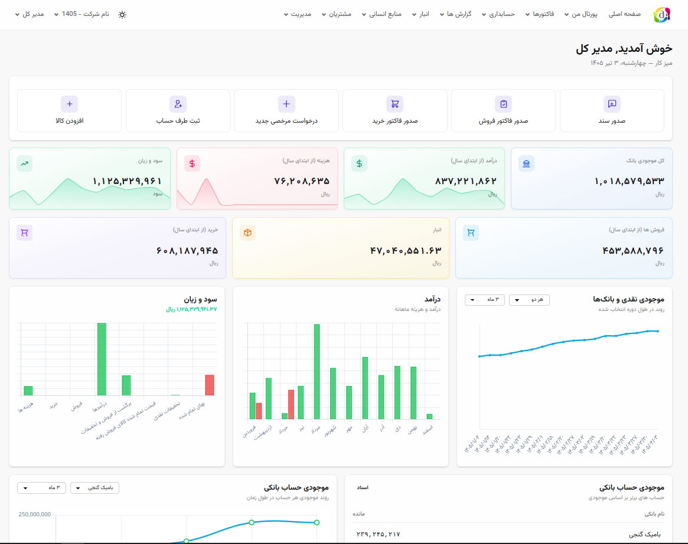
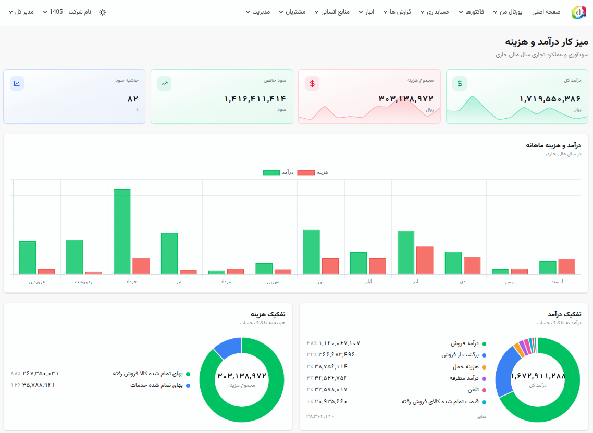
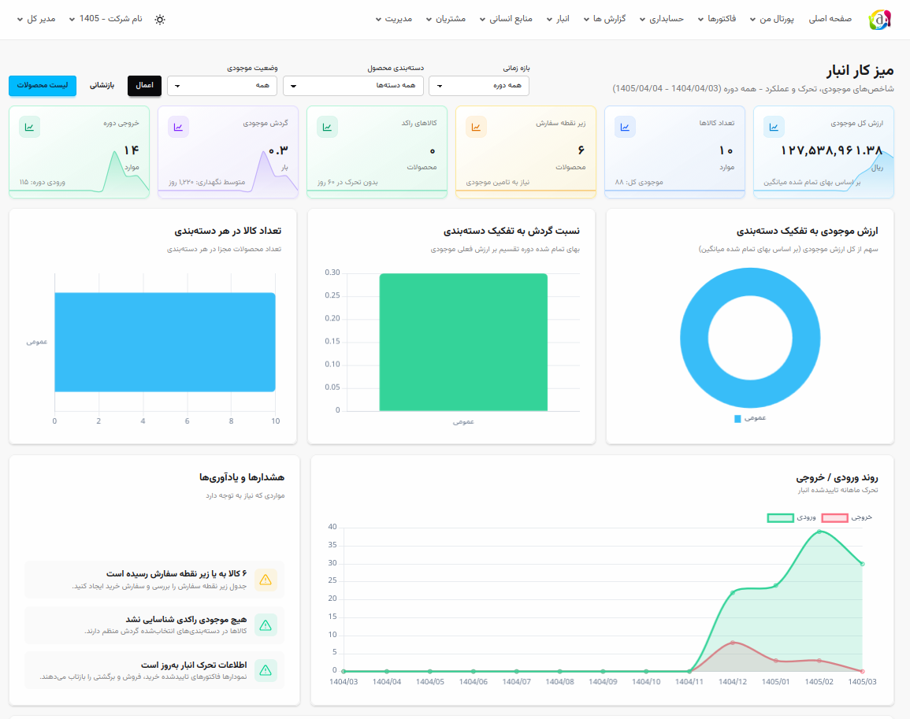
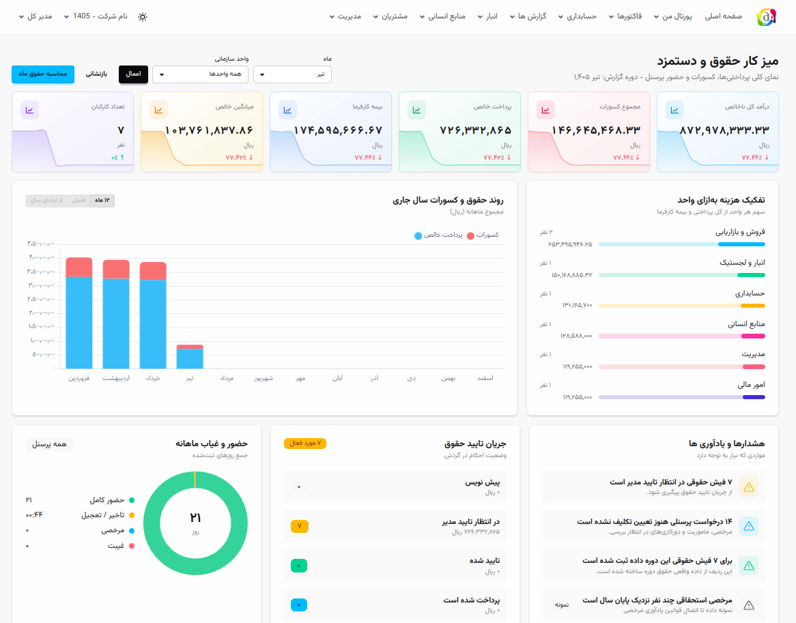
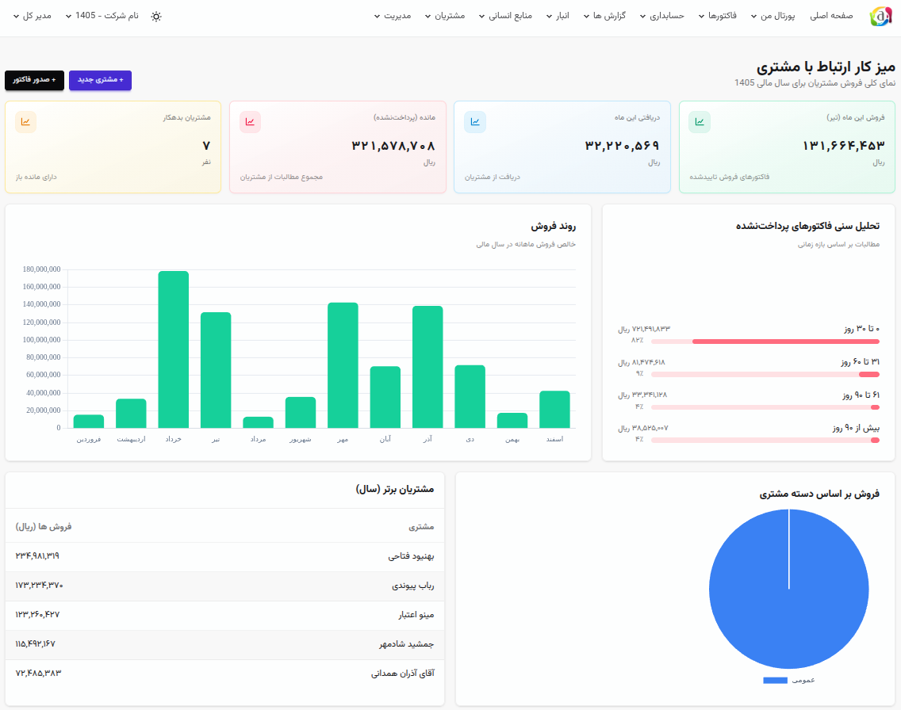
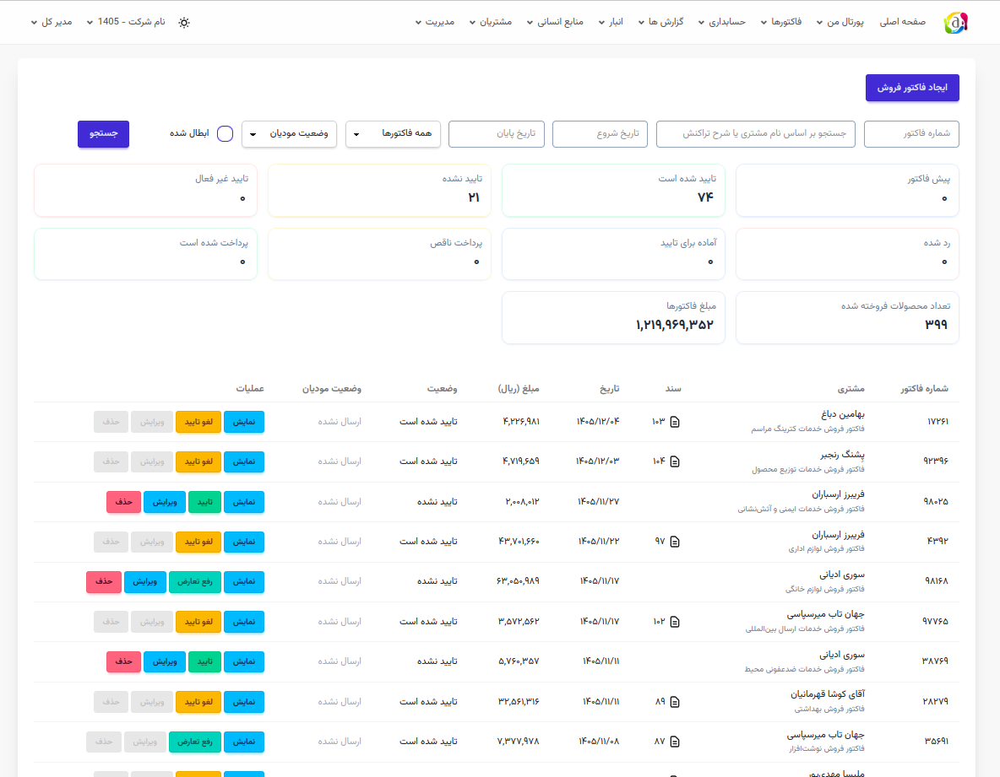
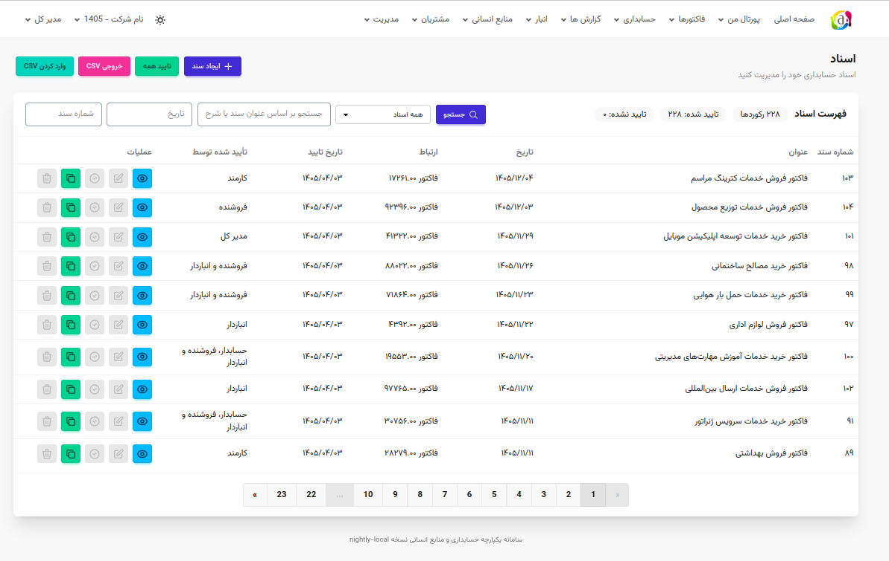
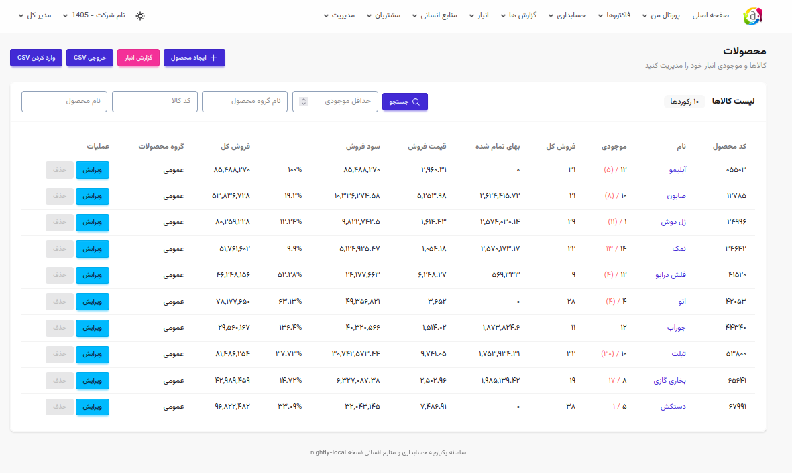
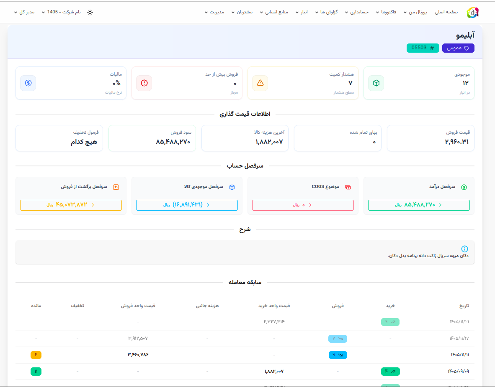

# نمایشگاه امیر

در این بخش تصاویری از محیط کاربری امیر مشاهده می‌کنید.


## صفحه اصلی




## داشبوردها

### داشبورد درآمد و هزینه



### داشبورد انبار



### داشبورد حقوق و دستمزد



### داشبورد مشتریان




## فاکتورها و اسناد

### لیست فاکتورها



### لیست اسناد




## محصولات

### لیست محصولات



### جزئیات محصول




## اجرای محلی برای مشاهده

```bash
docker run -d --name freeamir -p 80:80 ghcr.io/jooyeshgar/freeamir-all-in-one:latest
```

پس از اجرا، برنامه در آدرس http://localhost در دسترس خواهد بود.

