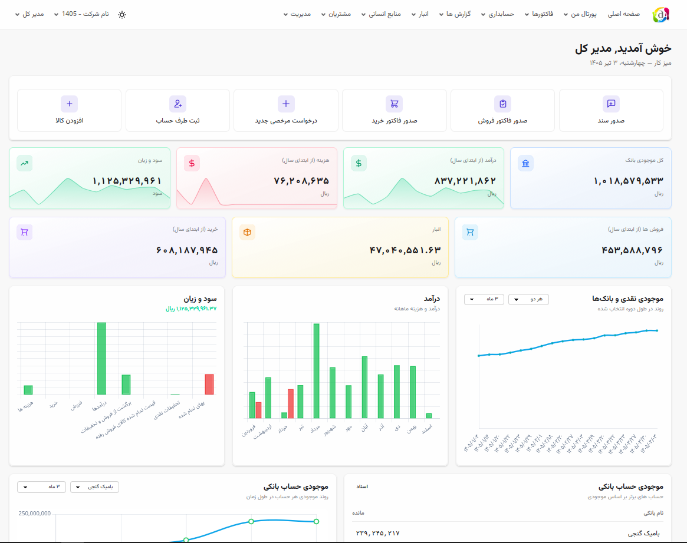
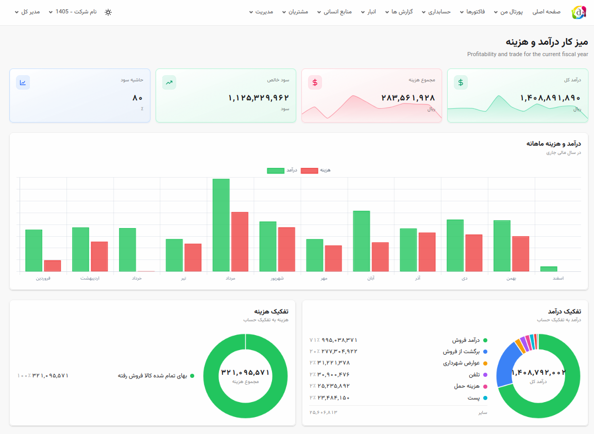
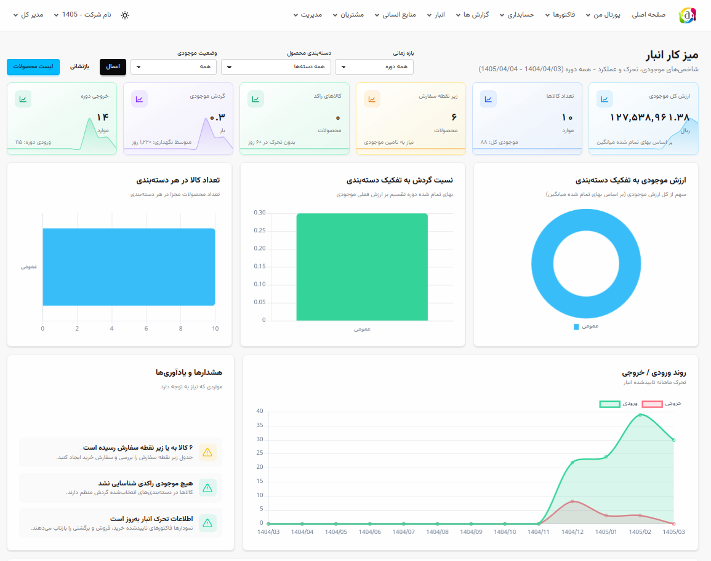
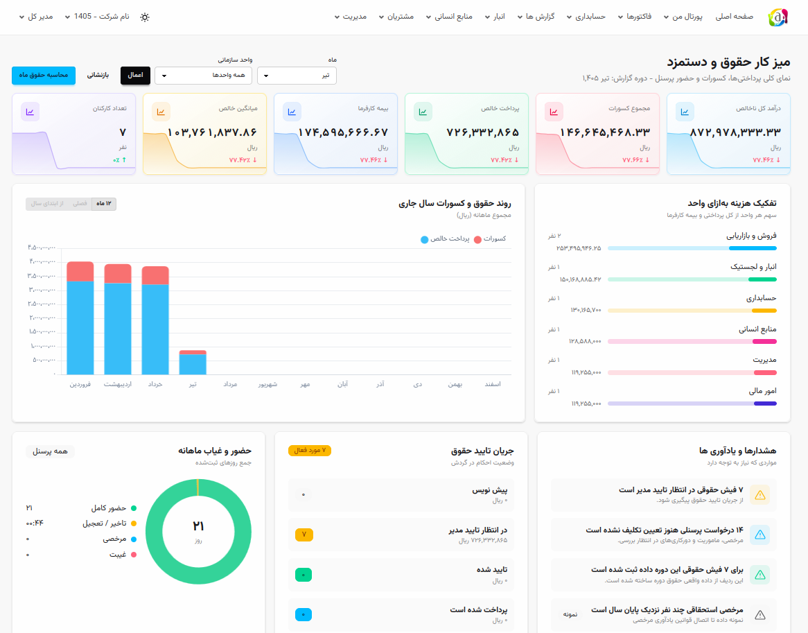
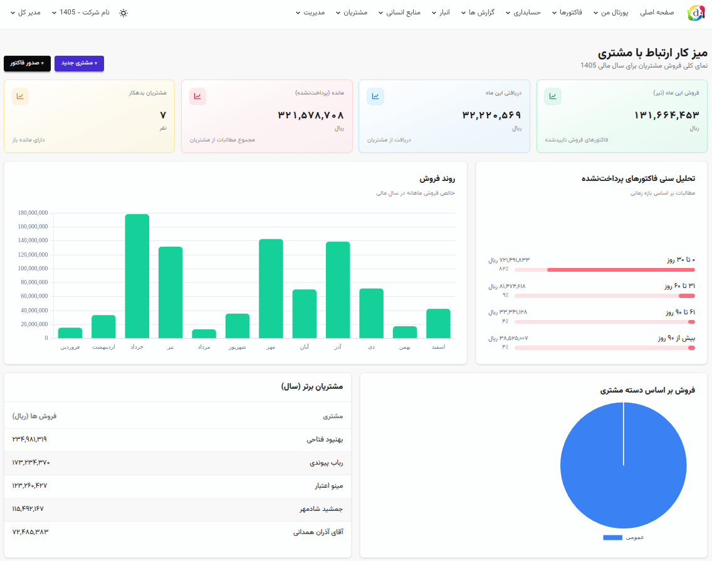
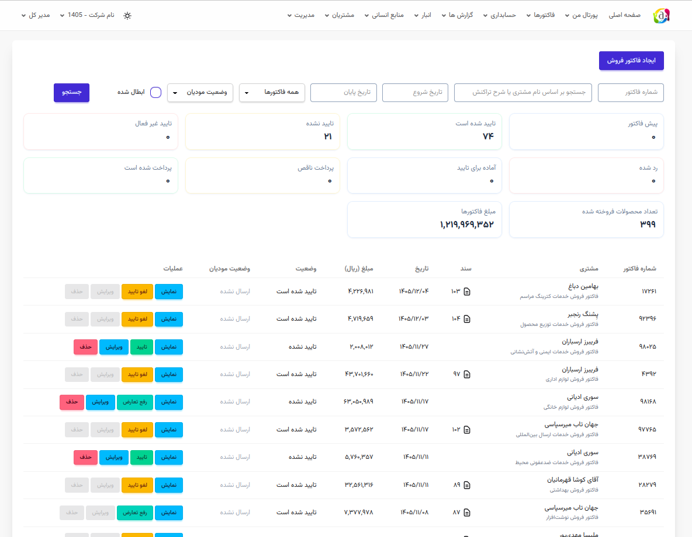
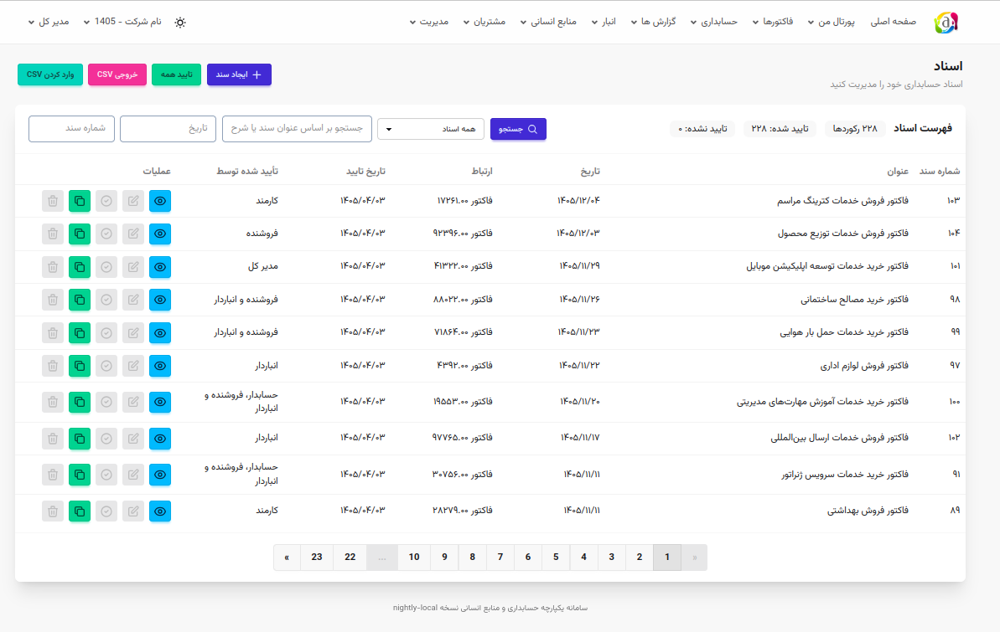
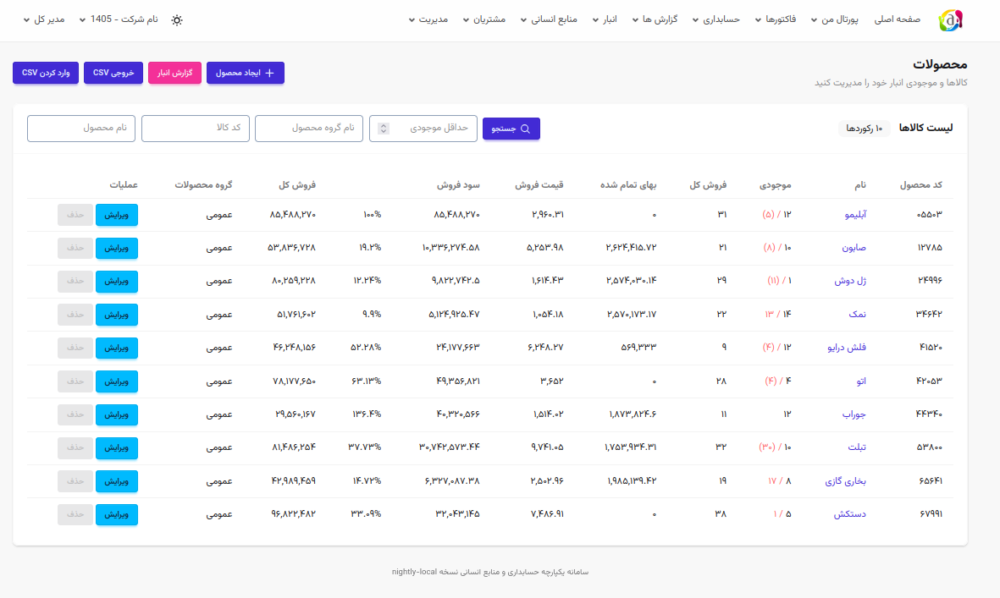
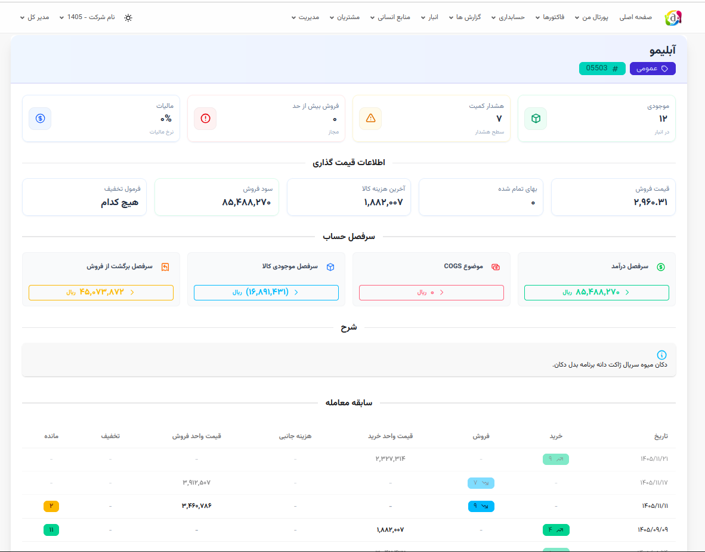

# Amir Screenshots

Below are previews of Amir's user interface.

---

## Main Page



---

## Dashboards

### Cost & Income Dashboard



### Warehouse Dashboard



### Salary Dashboard



### Customer Dashboard



---

## Invoices & Documents

### Invoice List



### Document List



---

## Products

### Product List



### Product Detail



---

## Run locally to explore

```bash
docker run -d --name freeamir -p 80:80 ghcr.io/jooyeshgar/freeamir-all-in-one:latest
```

Once running, the application is available at http://localhost.

